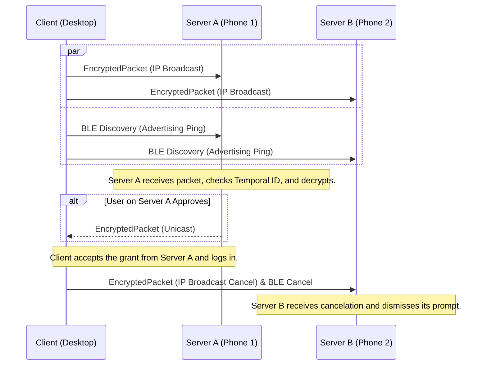

# Authentication Flow Protocol

## 1. Overview

This document specifies the network protocol for authenticating a user on a **Client** (e.g., a Linux desktop) using a paired **Server** (e.g., an Android phone). The protocol is designed for the lowest possible latency and high privacy by default.

The core design is a **parallel discovery model**:
* The Client initiates the process by simultaneously attempting discovery over both the **Local IP Network (IPv4 Broadcast & IPv6 Multicast)** and **Bluetooth Low Energy (BLE)**.
* The first successful discovery path triggers the authentication flow. All subsequent communication for that session continues over the successful transport.
* This "race" approach ensures the fastest possible connection without waiting for timeouts, providing a seamless and highly responsive user experience.

## 2. Technical Specifications

### 2.1. Message Encryption & Packet Structure

To ensure confidentiality and privacy, all post-pairing communication is encrypted and wrapped in a final packet structure that prevents passive tracking.

* **Packet Structure**: The final message sent over the network **must** be an `EncryptedPacket`.
* **Temporal Identifier Generation**:
    1.  Both Client and Server define a **time window** of 60 seconds. The current window is calculated as `floor(unix_timestamp / 60)`.
    2.  The identifier is the first 16 bytes of an HMAC-SHA256 of the time window, keyed with the shared `CSK`.
    3.  This creates a rotating identifier that is verifiable by the Server but appears random to an outside observer, preventing metadata tracking.
    4.  **BLE Advertisement Exception**: For BLE advertisements only, a shortened 10-byte temporal identifier (first 10 bytes of the HMAC-SHA256) is used to fit within the 31-byte BLE advertisement size limit. See `ble-gatt-specification.md` for details.
* **Process**:
    1.  Construct the full `WrapperMessage` with the desired payload (e.g., `AuthenticationRequest`).
    2.  Serialize the `WrapperMessage` to a byte array.
    3.  Construct the `EncryptedPacket`.
    4.  Set the `encryption_algorithm` field to the algorithm agreed upon during pairing (e.g., `AES_256_GCM`).
    5.  Encrypt the serialized `WrapperMessage` using the specified algorithm and the shared `CSK`. The result is placed in the `ciphertext` field.
    6.  Serialize and transmit the `EncryptedPacket`.

### 2.2. Timings and Retransmission Strategy

To ensure responsiveness, the protocol employs an aggressive retransmission strategy.

* **Client `AuthenticationRequest` Retransmission**:
    * **Strategy**: Exponential backoff.
    * **Intervals**: 200ms, 400ms, 800ms, 1600ms, 3200ms, 6400ms (doubling each retry).
    * **Rationale**: This ensures that a single dropped packet has a minimal impact on the initial notification time, while avoiding excessive network traffic.

* **Server `AuthenticationGrant`/`Denial` Retransmission**:
    * **Strategy**: Fixed interval.
    * **Interval**: **500ms**.
    * **Timeout**: **10 seconds** (maximum 20 retransmission attempts).
    * **Rationale**: After user interaction, the Server persistently delivers the result to ensure the login completes promptly even with network packet loss. The 10-second timeout with 20 attempts is sufficient for reliable delivery on local networks while conserving battery and network resources. Retransmission continues until a `GrantConfirmation` is received from the Client or the retransmission timeout expires.

* **Session Timeouts**:
    * The entire authentication attempt (from initial request to user interaction) will time out after **120 seconds**. This applies to the Client's login process and the user prompt on the Server.
    * Server response retransmission has a separate timeout of **10 seconds** as described above.

### 2.3. Signature Generation

All signed messages must use a canonical format to guarantee verifiability *before encryption*. Signatures are placed on the `WrapperMessage`, not on individual inner messages.

* **Data-To-Be-Signed**: The **binary-serialized `WrapperMessage`** with its `signature` field set to empty bytes. The `WrapperMessage` contains the inner payload (e.g., `AuthenticationRequest`) in its `payload` field.
* **Process**:
    1.  Construct the inner message object (e.g., `AuthenticationRequest`).
    2.  Place the inner message into a `WrapperMessage` using the appropriate `payload` variant.
    3.  Set the `signature_algorithm` field on the `WrapperMessage` to the algorithm agreed upon during pairing (e.g., `ED25519`).
    4.  Leave the `signature` field empty and serialize the `WrapperMessage` to a byte array. This is the data to be signed.
    5.  Sign the byte array using the sender's private key and the specified algorithm.
    6.  Place the resulting signature into the `signature` field of the `WrapperMessage`.
    7.  The completed `WrapperMessage` is then serialized, encrypted, and placed into an `EncryptedPacket` for transmission.

### 2.4. Transport Layer Considerations

The protocol is transport-agnostic, but relies on specific behaviors for discovery.

* **IP Network (Wired Ethernet or Wi-Fi)**:
    * **Port**: Uses UDP on port **`36692`**. This default port **must** be user-configurable.
    * **IPv4**: The Client sends to the broadcast address `255.255.255.255`.
    * **IPv6**: The Client sends to the link-local multicast address **`ff02::1`** (all nodes on local network segment).
    * **Response**: The Server responds via UDP unicast to the source IP of the request packet.

* **Bluetooth Low Energy (BLE)**:
    * The Client acts in the **Advertiser/Peripheral** role.
    * The Server acts in the **Scanner/Central** role.
    * **Advertisement**: Uses a 10-byte shortened temporal identifier in service data for discovery.
    * **GATT Transfer**: Once connected, uses standard `EncryptedPacket` with 16-byte temporal identifier via GATT characteristics.

## 3. Protocol Flow

### Step 1: Parallel Discovery (Client)

* When the PAM module is activated, the Client immediately begins broadcasting/advertising the `EncryptedPacket` containing the `AuthenticationRequest` on all available channels.

### Step 2: Request Handling (Server)

* The Server listens for discovery messages. Upon receiving an `EncryptedPacket`:
    1.  It reads the `temporal_identifier`.
    2.  For each `CSK` of its paired clients, it independently calculates the expected identifier for the **current time window** and the **previous time window**. To avoid re-computation, these two valid identifiers for each client **should** be cached and only re-calculated when the time window changes.
    3.  It compares the received identifier against its cached valid identifiers.
    4.  If no match is found, the packet is silently discarded.
    5.  If a match is found, it attempts a single decryption of the `ciphertext` using the corresponding `CSK`.
* Once successfully decrypted and deserialized, it verifies the signature on the inner `WrapperMessage` payload and performs replay mitigation checks.

#### Replay Attack Mitigation
An incoming `AuthenticationRequest` **must** be validated against two independent mechanisms to prevent replay attacks. Both checks must pass for the request to be considered valid.

1.  **Nonce Check (Primary Defense)**: The `challenge` field in the request acts as a unique nonce for the authentication session. The Server **must** maintain a cache of all received `challenge` nonces for the duration of the session timeout (120 seconds). If a request is received with a `challenge` that is already in the cache, it is a replay and **must** be silently discarded.

2.  **Timestamp Check (Secondary Defense)**: The `timestamp_unix_seconds` in the request is compared against the Server's current UTC time. If the timestamp is older than a **60-second** validity window, it is considered stale and **must** be silently discarded. This prevents the replay of very old packets that may have been captured from a previous session and are no longer in the nonce cache.

### Step 3: Response (Server)

* The Server constructs and signs an `AuthenticationGrant` or `AuthenticationDenial` message.
* It wraps and encrypts this into an `EncryptedPacket` and sends it back to the Client using the **same transport layer** that the initial discovery message arrived on, retransmitting until a confirmation is received or timeout.

### Step 4: Finalization (Client)

* The Client accepts the first valid `EncryptedPacket` containing an `AuthenticationGrant` or `AuthenticationDenial` that it can successfully decrypt.
* Upon successful decryption of either message type, it **must** send a final `EncryptedPacket` containing a `GrantConfirmation` back to the granting Server to halt retransmissions. If further retransmissions are received after this point, the `GrantConfirmation` must be resent up to three times.

### Step 5: Cancelation (All Transports)

* If the client is unlocked (e.g., through a successful `AuthenticationGrant`), it broadcasts/multicasts a final `EncryptedPacket` containing an `AuthenticationCancel` message to ensure all other Servers dismiss their pending user prompts.