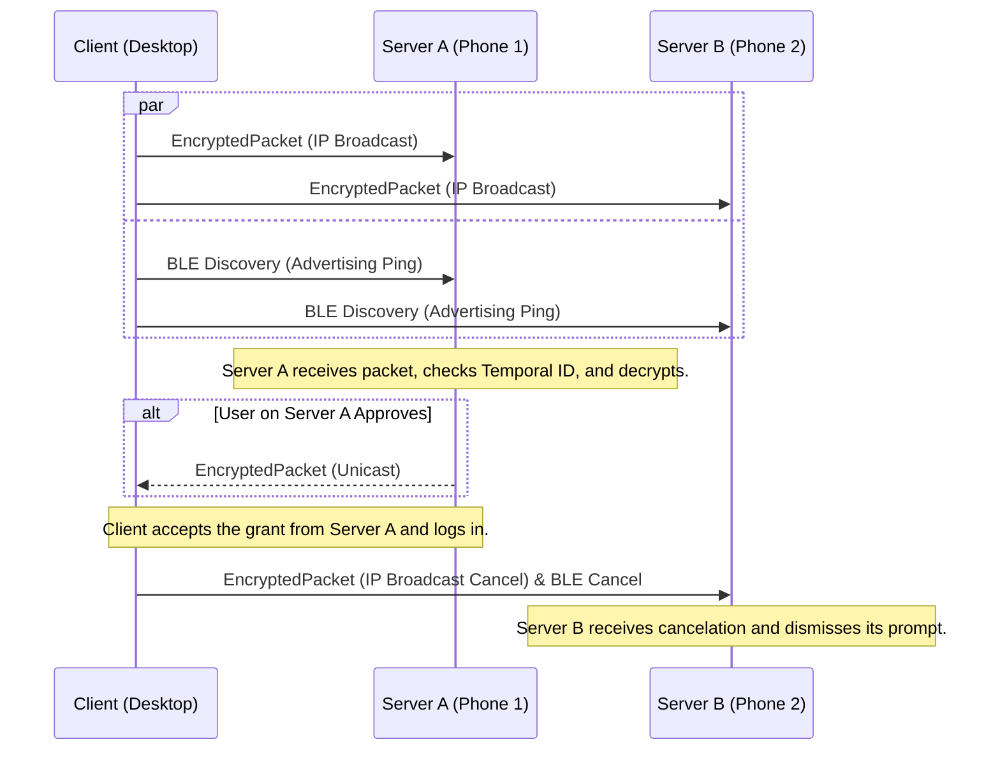

# Authentication Flow Protocol

## 1. Overview

This document specifies the network protocol for authenticating a user on a **Client** (e.g., a Linux desktop) using a paired **Server** (e.g., an Android phone). The protocol is designed for the lowest possible latency and high privacy by default.

The core design is a **parallel discovery model**:
* The Client initiates the process by simultaneously attempting discovery over both the **Local IP Network (IPv4 Broadcast & IPv6 Multicast)** and **Bluetooth Low Energy (BLE)**.
* The first successful discovery path triggers the authentication flow. All subsequent communication for that session continues over the successful transport.
* This "race" approach ensures the fastest possible connection without waiting for timeouts, providing a seamless and highly responsive user experience.

## 2. Technical Specifications

### 2.1. Message Encryption & Packet Structure

To ensure confidentiality and privacy, all post-pairing communication is encrypted and wrapped in a final packet structure that prevents passive tracking.

* **Packet Structure**: The final message sent over the network **must** be an `EncryptedPacket`.
* **Temporal Identifier Generation**:
    1.  Both Client and Server define a **time window** of 60 seconds. The current window is calculated as `floor(unix_timestamp / 60)`.
    2.  The `temporal_identifier` is the **first 16 bytes** of the following calculation: `HMAC-SHA256(key = CSK, data = current_time_window)`.
    3.  This creates a rotating identifier that is verifiable by the Server but appears random to an outside observer, preventing metadata tracking.
* **Process**:
    1.  Construct the full `WrapperMessage` with the desired payload (e.g., `AuthenticationRequest`).
    2.  Serialize the `WrapperMessage` to a byte array.
    3.  Encrypt this byte array using the `CSK` with **AES-256-GCM** to get the `ciphertext`.
    4.  Calculate the current `temporal_identifier`.
    5.  Construct an `EncryptedPacket` with the `temporal_identifier` and `ciphertext`.
    6.  Serialize and transmit the `EncryptedPacket`.

### 2.2. Timings and Retransmission Strategy

To ensure responsiveness, the protocol employs an aggressive retransmission strategy.

* **Client `AuthenticationRequest` Retransmission**:
    * **Strategy**: Exponential backoff.
    * **Initial Interval**: **200ms**. The first retransmission is sent 200ms after the initial message.
    * **Backoff Schedule**: The interval doubles with each subsequent retry (400ms, 800ms, etc.).
    * **Rationale**: This ensures that a single dropped packet has a minimal impact on the initial notification time.

* **Server `AuthenticationGrant`/`Denial` Retransmission**:
    * **Strategy**: Fixed interval.
    * **Interval**: **500ms**.
    * **Rationale**: After user interaction, the Server becomes persistent in delivering the result to ensure the login completes promptly.

* **Session Timeouts**:
    * The entire authentication attempt will time out after **120 seconds**. This applies to the Client's login process and the user prompt on the Server.

### 2.3. Signature Generation

All signed messages must use a canonical format to guarantee verifiability *before encryption*.

* **Data-To-Be-Signed**: The **binary-serialized Protobuf message** (e.g., `AuthenticationRequest`) with its `signature` field temporarily empty.
* **Process**:
    1.  Construct the inner message object (e.g., `AuthenticationRequest`).
    2.  Ensure its `signature` field is empty.
    3.  Serialize the object to a byte array using the standard Protobuf library.
    4.  Compute the digital signature of this byte array.
    5.  Place the computed signature back into the `signature` field.
    6.  This completed message is then placed in a `WrapperMessage`, which is then encrypted for transmission.

### 2.4. Transport Layer Considerations

The protocol is transport-agnostic, but relies on specific behaviors for discovery.

* **IP Network (Wired Ethernet or Wi-Fi)**:
    * **Port**: Uses UDP on port **`36692`**. This default port **must** be user-configurable.
    * **IPv4**: The Client sends to the broadcast address `255.255.255.255`.
    * **IPv6**: The Client sends to the designated link-local multicast address **`ff02:bfb4:3e78:bc99:80f5:f6e5:9e8e:45b8`**.
    * **Response**: The Server responds via UDP unicast to the source IP of the request packet.

* **Bluetooth Low Energy (BLE)**:
    * The Client acts in the **Advertiser/Peripheral** role.
    * The Server acts in the **Scanner/Central** role.

## 3. Protocol Flow

### Step 1: Parallel Discovery (Client)

* When the PAM module is activated, the Client immediately begins broadcasting/advertising the `EncryptedPacket` containing the `AuthenticationRequest` on all available channels.

### Step 2: Request Handling (Server)

* The Server listens for discovery messages. Upon receiving an `EncryptedPacket`:
    1.  It reads the `temporal_identifier`.
    2.  For each `CSK` of its paired clients, it independently calculates the expected identifier for the **current time window** and the **previous time window** (to account for clock drift and network delay).
    3.  It compares the received identifier against its calculated identifiers.
    4.  If no match is found, the packet is silently discarded.
    5.  If a match is found, it attempts a single decryption of the `ciphertext` using the corresponding `CSK`.
* Once successfully decrypted and deserialized, it verifies the signature on the inner `WrapperMessage` payload and performs replay mitigation checks.

#### Replay Attack Mitigation
An incoming `AuthenticationRequest` **must** pass both checks:

1.  **Timestamp Check**: The `timestamp_unix_seconds` in the request is compared against the Server's current UTC time. If the timestamp is older than a **60-second** validity window, it **must** be silently discarded. This timestamp check serves as a secondary defense to reject obviously stale packets (e.g., from a delayed network or a malicious replay hours later), preventing them from triggering user notifications.
2.  **Nonce Check**: The primary cryptographic defense against replay attacks remains the single-use `challenge` nonce. The Server checks if it has already processed a request with the same `challenge` nonce in the last 120 seconds. If it has, the request is a duplicate and **must** be silently discarded.

### Step 3: Response (Server)

* The Server constructs and signs an `AuthenticationGrant` or `AuthenticationDenial` message.
* It wraps and encrypts this into an `EncryptedPacket` and sends it back to the Client using the **same transport layer** that the initial discovery message arrived on.

### Step 4: Finalization (Client)

* The Client accepts the first valid `EncryptedPacket` containing an `AuthenticationGrant` that it can successfully decrypt.
* It sends a final `EncryptedPacket` containing a `GrantConfirmation` back to the granting Server.

### Step 5: Cancelation (All Transports)

* The Client broadcasts/multicasts a final `EncryptedPacket` containing an `AuthenticationCancel` message to ensure all other Servers dismiss their pending user prompts.