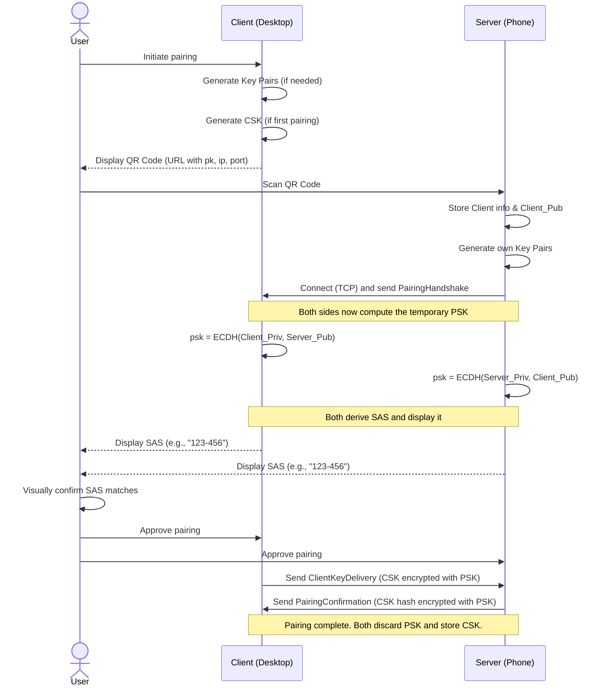

# Initial Key Exchange Protocol

## Overview

This document outlines a secure and byte-efficient protocol for the initial pairing of a **Client** (e.g., a Linux desktop) with a **Server** (e.g., an Android phone). The goal is to securely share the Client's long-term symmetric key with a new Server. The protocol uses a QR code to bootstrap trust, a high-speed key exchange to create a temporary secure channel, and a user-verified Short Authentication String (SAS) to prevent Man-in-the-Middle (MITM) attacks.

***

## Cryptography and Keys

* **Cryptographic Primitives**: All cryptographic algorithms used in this protocol are explicitly defined in the [`cryptography-specification.md`](cryptography-specification.md) document.
* **Key Exchange**: An X25519 key exchange is performed to generate a temporary **Pairing Symmetric Key (`PSK`)**.
* **Client Symmetric Key** (`CSK`): The Client's long-term key for encrypting all standard communication. This is the key that will be shared during this protocol.

***

## Pairing Protocol Visualization

***

## Pairing Protocol Steps

### Step 1: Client Presents QR Code

The **Client (desktop)** generates its key pair (if one doesn't exist) and its Client Symmetric Key (`CSK`) if this is its first-ever pairing. It encodes its connection information into a QR code which **must** contain a custom URL with the following format:

`tapauth://pair?v=1&pk=<hex_encoded_pubkey>&p=<port>&ip4=<ipv4_address>&ip6=<ipv6_address>`

* **`tapauth://pair`**: The scheme and action that identifies this as a TapAuth pairing request.
* **`v=1`**: The protocol version for the pairing process.
* **`pk`**: The Client's 32-byte public key, encoded as a hexadecimal string.
* **`p`**: The **TCP** port the Client is listening on for the pairing connection.
* **`ip4` / `ip6`**: The Client's IP addresses. At least one **must** be present.

### Step 2: Server Initiates Connection

The **User** scans the code with the **Server (phone)**. The app parses the URL, extracts the Client's public key and connection details, generates its own key pair, and establishes a **TCP connection** to the Client. It sends its public key inside a `PairingHandshake` message.

### Step 3: Temporary Key Agreement

Both devices independently compute the same temporary **Pairing Symmetric Key (`PSK`)** using X25519 and the specified KDF. This key exists only for the duration of this pairing session.

### Step 4: Anti-MITM Verification

Both devices compute and display a **Short Authentication String (SAS)** derived from the `PSK` and the public keys. The **User must visually confirm** that the SAS displayed on the Client and Server screens match before proceeding.

### Step 5: Client Sends Shared Key

After the user confirms the SAS on the Client, the Client sends a `ClientKeyDelivery` message to the Server. This message contains the long-term `CSK`, encrypted with the temporary `PSK`.

### Step 6: Server Confirms and Finalizes

The Server receives the message and decrypts it using the `PSK` to retrieve the `CSK`. After the user confirms the SAS on the Server, it computes a SHA-256 hash of the received `CSK`. It then sends a `PairingConfirmation` message back to the Client, containing this hash, also encrypted with the `PSK`.

### Step 7: Completion

The Client decrypts the confirmation. If the hash matches the hash of the `CSK` it sent, the pairing is successful. Both devices **must** now securely discard the ephemeral `PSK` and store the long-term `CSK` for all future communication.