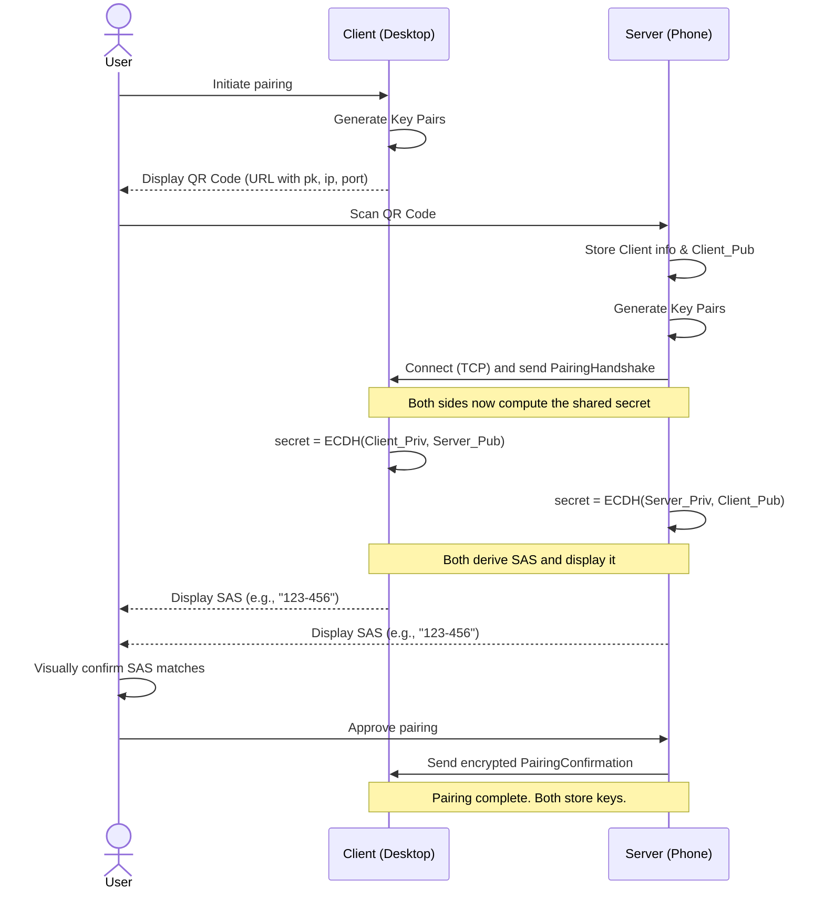

# Initial Key Exchange Protocol

## Overview

This document outlines a secure and byte-efficient protocol for the initial pairing of a **Client** (e.g., a Linux desktop) with a **Server** (e.g., an Android phone). The goal is to establish a mutually authenticated, secure channel for future communication. The protocol uses a QR code to bootstrap trust, a high-speed key exchange for forward secrecy, and a user-verified Short Authentication String (SAS) to prevent Man-in-the-Middle (MITM) attacks.

***

## Cryptography and Keys

* **Cryptographic Primitives**: All cryptographic algorithms used in this protocol are explicitly defined in the [`cryptography-specification.md`](cryptography-specification.md) document.
* **Key Exchange**: An X25519 key exchange is performed to generate a shared secret.
* **Shared Symmetric Key** (`SK`): A key for the AEAD cipher derived from the key exchange result using the specified KDF.

***

## Pairing Protocol Visualization

***

## Pairing Protocol Steps

### Step 1: Client Presents QR Code

The **Client (desktop)** generates its key pair and encodes its connection information into a QR code. This QR code **must** contain a custom URL with the following format:

`tapauth://pair?v=1&pk=<hex_encoded_pubkey>&p=<port>&ip4=<ipv4_address>&ip6=<ipv6_address>`

* **`tapauth://pair`**: The scheme and action that identifies this as a TapAuth pairing request.
* **`v=1`**: The protocol version for the pairing process.
* **`pk`**: The Client's 32-byte public key, encoded as a hexadecimal string.
* **`p`**: The **TCP** port the Client is listening on for the pairing connection.
* **`ip4` / `ip6`**: The Client's IP addresses. At least one **must** be present.

This URL format ensures easy parsing, support for all IP configurations, and a good user experience when scanned by a standard camera app.

### Step 2: Server Initiates Connection

The **User** scans the code with the **Server (phone)**. The app parses the URL, extracts the Client's public key and connection details, generates its own key pair, and establishes a **TCP connection** to the Client via one of the provided IP addresses, sending its public key inside a `PairingHandshake` message.

### Step 3: Key Agreement and Derivation

Both devices independently compute the same `Shared_Secret` using X25519 and derive a symmetric `SK`.

### Step 4: Anti-MITM Verification

Both devices compute and display a **Short Authentication String (SAS)** from the secret.

### Step 5: User Confirmation and Finalization

The **User visually confirms** the SAS matches and approves the pairing. The Server sends a final encrypted `PairingConfirmation` message to the Client.