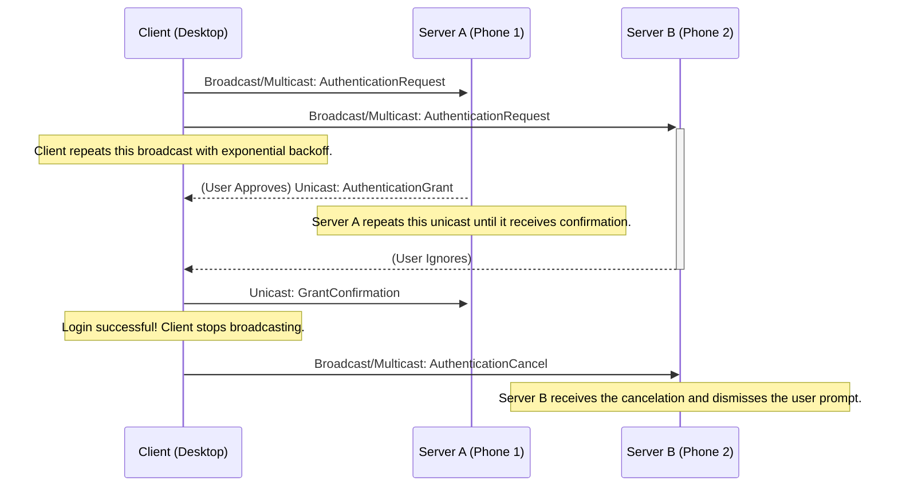

# Authentication Flow

## Overview

The authentication flow is designed for minimal latency and maximum reliability. It uses a **dual IPv4 broadcast and IPv6 multicast** for discovery, followed by direct unicast communication. The protocol explicitly defines retransmission and confirmation steps to handle UDP packet loss and ensures that stale requests on other devices are canceled promptly.

## Signature Generation

To ensure signatures are always valid and verifiable across platforms, the data being signed must have a canonical, unambiguous representation.

* **Data-To-Be-Signed**: The data to be signed is the **binary-serialized Protobuf message** (e.g., `AuthenticationRequest` or `AuthenticationGrant`) with its `signature` field temporarily empty.
* **Process**:
    1.  Construct the message object in code.
    2.  Ensure the `signature` field within that object is empty or null.
    3.  Serialize the object to a byte array using the standard Protobuf serialization library.
    4.  Compute the digital signature of this resulting byte array.
    5.  Place the computed signature back into the `signature` field of the object before wrapping and encrypting it for transmission.

This guarantees that both the signer and the verifier are operating on the exact same sequence of bytes.

***

## Protocol Steps & Reliability

1.  **Request Broadcast & Multicast (Client)**:
    * When the PAM module is activated, the **Client (desktop)** constructs an `AuthenticationRequest`.
    * It signs the message as per the "Signature Generation" process and sends the encrypted `WrapperMessage` via both **IPv4 broadcast and IPv6 multicast**.
    * **Reliability**: The Client will re-broadcast this request, starting with a short interval (e.g., 500ms) and using an exponential backoff, until it receives a valid `AuthenticationGrant` or the login process times out.

2.  **Verification and Prompt (Server)**:
    * All paired **Servers (phones)** receive the request and verify the signature to identify the Client.
    * The `challenge` nonce is used to de-duplicate the IPv4 and IPv6 packets.
    * Each Server then prompts its user for approval.

3.  **Grant/Denial Unicast (Server)**:
    * **If the user approves**, the Server sends the `AuthenticationGrant` via **unicast** to the Client.
    * **If the user denies**, the Server sends an `AuthenticationDenial` via **unicast**.
    * **Reliability**: The Server will re-send the `AuthenticationGrant` or `AuthenticationDenial` at a fixed interval (e.g., every 1 second) until it receives a `GrantConfirmation` from the Client or a timeout occurs. This ensures the Client receives the response even if the first packet is dropped.

4.  **Confirmation and Cancelation (Client)**:
    * The Client accepts the **first valid `AuthenticationGrant`** it receives.
    * **Immediately upon acceptance**:
        1.  **Confirm**: The Client sends a **unicast** `GrantConfirmation` message directly back to the specific Server that sent the grant. This tells that Server to stop retransmitting.
        2.  **Cancel**: The Client broadcasts/multicasts an `AuthenticationCancel` message to the entire network. This message contains the original `challenge` nonce.
        3.  **Login**: The PAM module unlocks the user account.

5.  **Handling Cancelation (Other Servers)**:
    * Any other Server (e.g., a second phone) that still has a pending user prompt will receive the `AuthenticationCancel` message.
    * It checks if the `challenge` in the cancel message matches the one in its active request. If it does, it automatically dismisses the notification from the user's screen.