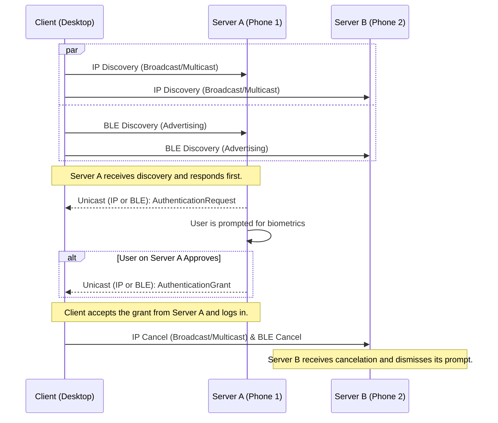

# Authentication Flow Protocol

## 1. Overview

This document specifies the network protocol for authenticating a user on a **Client** (e.g., a Linux desktop) using a paired **Server** (e.g., an Android phone). The protocol is designed for the lowest possible latency by attempting discovery over multiple transport layers simultaneously.

The core design is a **parallel discovery model**:
* The Client initiates the process by simultaneously attempting discovery over both the **Local IP Network (IPv4 Broadcast & IPv6 Multicast)** and **Bluetooth Low Energy (BLE)**.
* The first successful discovery path triggers the authentication flow. All subsequent communication for that session continues over the successful transport.
* This "race" approach ensures the fastest possible connection without waiting for timeouts, providing a seamless and highly responsive user experience.

## 2. Technical Specifications

### 2.1. Timings and Retransmission Strategy

To ensure responsiveness, the protocol employs an aggressive retransmission strategy.

* **Client `AuthenticationRequest` Retransmission**:
    * **Strategy**: Exponential backoff.
    * **Initial Interval**: **200ms**. The first retransmission is sent 200ms after the initial message.
    * **Backoff Schedule**: The interval doubles with each subsequent retry (400ms, 800ms, etc.).
    * **Rationale**: This ensures that a single dropped packet has a minimal impact on the initial notification time.

* **Server `AuthenticationGrant`/`Denial` Retransmission**:
    * **Strategy**: Fixed interval.
    * **Interval**: **500ms**.
    * **Rationale**: After user interaction, the Server becomes persistent in delivering the result to ensure the login completes promptly.

* **Session Timeouts**:
    * The entire authentication attempt will time out after **120 seconds**. This applies to the Client's login process and the user prompt on the Server.

### 2.2. Signature Generation

All signed messages must use a canonical format to guarantee verifiability.

* **Data-To-Be-Signed**: The **binary-serialized Protobuf message** with its `signature` field temporarily empty.
* **Process**:
    1.  Construct the message object.
    2.  Ensure the `signature` field is empty.
    3.  Serialize the object to a byte array using the standard Protobuf library.
    4.  Compute the digital signature of this byte array.
    5.  Place the computed signature back into the `signature` field before sending.

### 2.3. Transport Layer Considerations

The protocol is transport-agnostic, but relies on specific behaviors for discovery.

* **IP Network (Wired Ethernet or Wi-Fi)**: Uses UDP. The Client sends to the IPv4 broadcast and a designated IPv6 multicast address. The Server responds via UDP unicast to the source IP of the request packet.
* **Bluetooth Low Energy (BLE)**:
    * **No OS-level pairing is required.** The security is enforced by the application-layer cryptography established during the initial key exchange.
    * The Client acts in the **Advertiser/Peripheral** role.
    * The Server acts in the **Scanner/Central** role.
    * The `AuthenticationRequest` is sent over a dedicated GATT characteristic after the connection is established.

## 3. Protocol Flow

### Step 1: Parallel Discovery (Client)

* When the PAM module is activated, the Client immediately initiates discovery on all available channels **simultaneously**:
    1.  **IP Network**: It broadcasts/multicasts the signed `AuthenticationRequest` over IPv4 and IPv6.
    2.  **BLE**: It begins BLE advertising, identifying itself as a ready-to-authenticate client.
* The Client will continue this process according to the retransmission schedule until a valid grant is received.

### Step 2: Request Handling (Server)

* The Server (phone) simultaneously listens for IP packets and scans for BLE advertisements.
* Upon receiving the **first successful discovery message** (either via IP or BLE), the Server proceeds and ignores subsequent discovery attempts for the same session (identified by the `challenge`).
* It verifies the signature to authenticate the Client and displays a prompt for user interaction.
* **Handling Superseded Requests**: If the Server receives a new `AuthenticationRequest` from a Client that already has an active prompt, the old request is immediately discarded, and a new prompt is shown.

### Step 3: Response (Server)

* The Server constructs an `AuthenticationGrant` or `AuthenticationDenial` message.
* It sends the response back to the Client using the **same transport layer** (IP unicast or the established BLE connection) that the initial discovery message arrived on.
* The Server will retransmit this response until it receives a `GrantConfirmation` or the session times out.

### Step 4: Finalization (Client)

* The Client accepts the **first valid `AuthenticationGrant`** it receives, regardless of which transport layer it arrived on.
* Immediately upon validation, the Client performs its final actions in parallel:
    1.  **Confirmation**: It sends a unicast `GrantConfirmation` back to the granting Server over the same channel that delivered the grant.
    2.  **Cancelation**: It initiates the cancelation process described in Step 5.
* The PAM module then unlocks the user account.

### Step 5: Cancelation (All Transports)

* To ensure all pending prompts are dismissed, the Client sends a cancelation signal across all transports:
    * **IP Network**: The Client broadcasts/multicasts an `AuthenticationCancel` message.
    * **BLE**: The Client immediately stops BLE advertising for this session and terminates any outstanding BLE connections related to this login attempt.
* Any other Server that has a pending user prompt will either receive the IP `AuthenticationCancel` message or have its BLE connection terminated by the Client. Both signals should be interpreted as a session cancelation, causing the Server to dismiss the user notification.