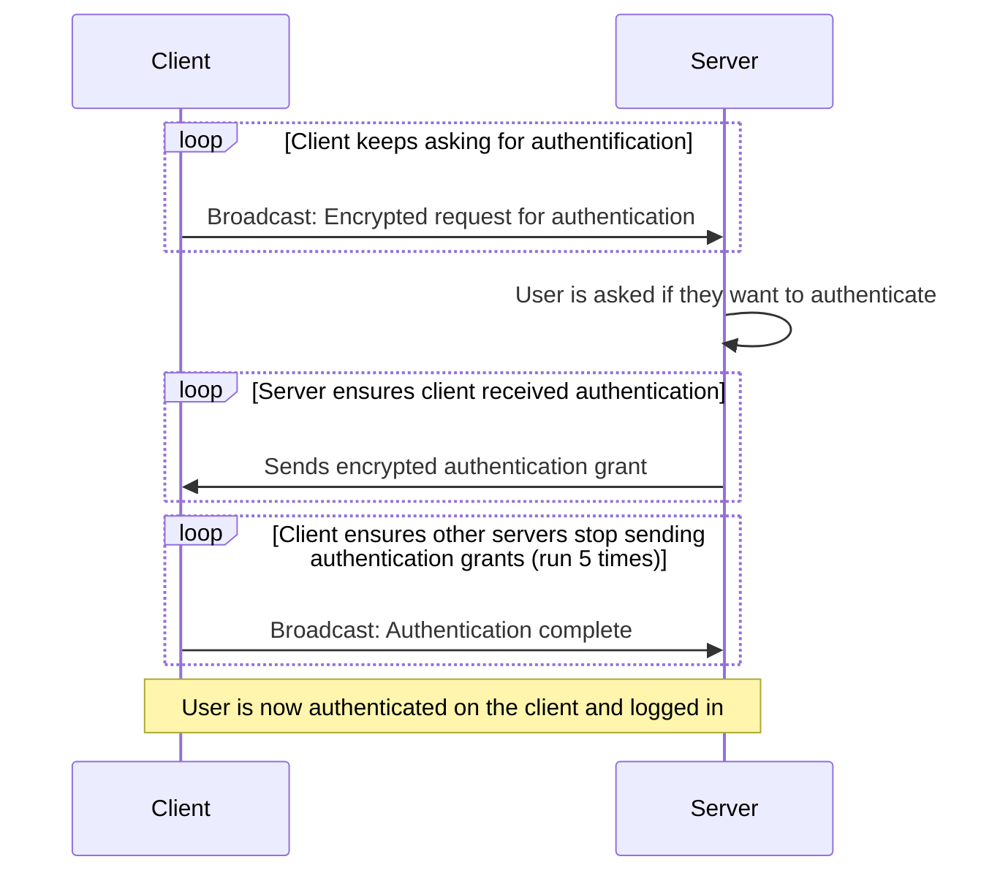
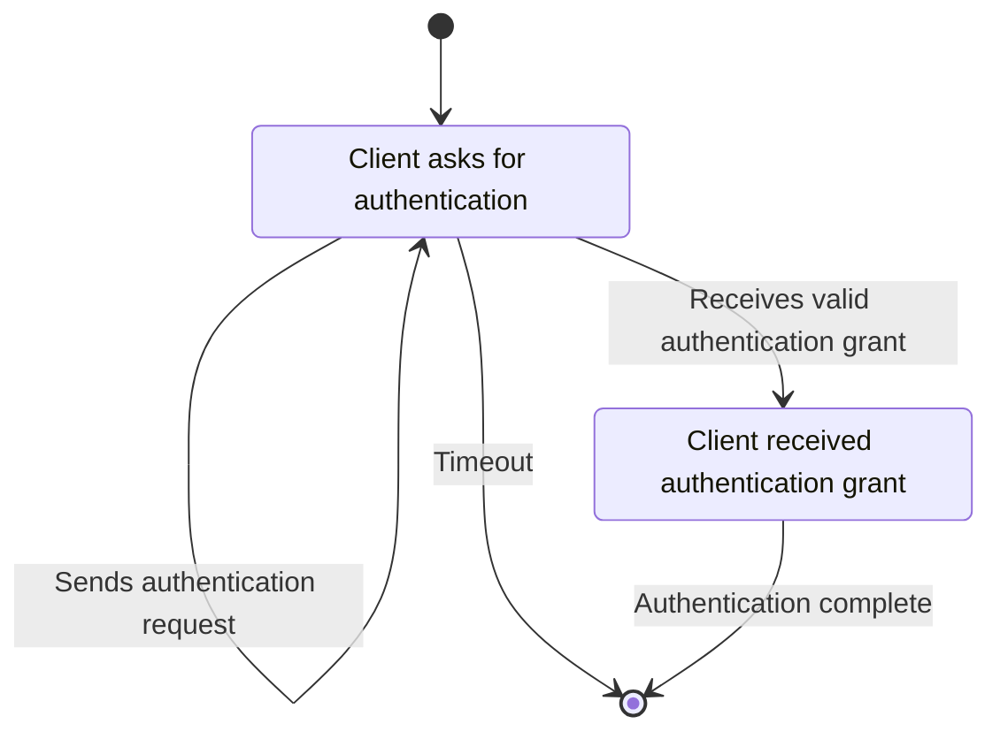
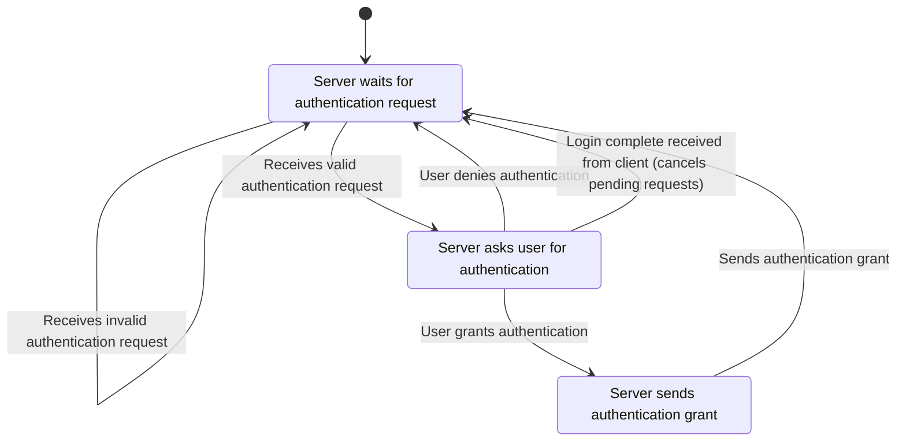

# Authentication Flow

The basic authentication flow is as follows:

To reduce latency, as few round-trips as possible should be used. The client requesting authentication will keep broadcasting the request until it receives a valid authentication grant from the server. Otherwise it will keep asking in progressively longer intervals, to avoid spamming the network. The request is kept short to fit in a single UDP packet, and is encrypted to avoid leaking information about the user. By keeping it short, sending the request often will not be a big burden on the network.

When the server receives an authentication request, it will ask the user if they want to authenticate (see [user authentication interaction flow](user-authentication-flow.md#user-grants-authentication-on-server-ie-scans-their-fingerprint)). If they do, it will send an encrypted authentication grant back to the client. The grant is also kept short to fit in a single UDP packet, and is encrypted to avoid leaking information about the user.

## State diagram

### Client asks for authentication

Notably timout doesn't really mean that the client stops listening, but it will no longer actively ask for authentication. The client will keep listening for authentication grants until it either receives one, or the user cancels the login attempt. This timeout is configurable, and should be long enough to allow the user to interact with the server.

### Server waits for authentication request

When sending the authentication grant, the server will keep sending it until it receives a confirmation from the client that the authentication is complete. This ensures that the client has received the grant, even if packets are lost or arrive out of order. The client will send the confirmation as soon as it receives a valid authentication grant as a broadcast message. This should also cancel pending authentication requests from on other servers.

## Usage of a PAM module

In order to unlock the user account on the client, a PAM (Pluggable Authentication Module) module will be used. This module will handle the communication with the authentication app, and will be responsible for unlocking the user account when a valid authentication grant is received. The PAM module will be invoked by the display manager (e.g. GDM, SDDM, LightDM) when the user selects their account on the login screen. The PAM module will then start the authentication flow as described above.