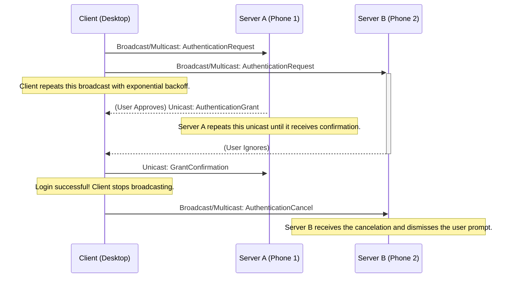

# Authentication Flow Protocol

## 1. Overview

This document specifies the network protocol for authenticating a user on a **Client** (e.g., a Linux desktop) using a paired **Server** (e.g., an Android phone). The protocol is designed for minimal latency and high reliability on local networks, even with packet loss or multiple paired devices.

The core design is a **hybrid discovery model**:
* The Client initiates the process by sending a discovery message using **IPv4 broadcast and IPv6 multicast**. This ensures it can be found by any paired Server on any common network configuration (IPv4-only, IPv6-only, or dual-stack).
* All subsequent communication is performed using direct **unicast** messages for efficiency and security.
* The protocol includes explicit retransmission, confirmation, and cancelation mechanisms to create a robust and responsive user experience.

## 2. Technical Specifications

### 2.1. Timings and Retransmission Strategy

To ensure responsiveness, the protocol employs an aggressive retransmission strategy.

* **Client `AuthenticationRequest` Retransmission**:
    * **Strategy**: Exponential backoff.
    * **Initial Interval**: **200ms**. The first retransmission is sent 200ms after the initial message.
    * **Backoff Schedule**: The interval doubles with each subsequent retry (400ms, 800ms, etc.).
    * **Rationale**: This ensures that a single dropped packet has a minimal impact on the initial notification time.

* **Server `AuthenticationGrant`/`Denial` Retransmission**:
    * **Strategy**: Fixed interval.
    * **Interval**: **500ms**.
    * **Rationale**: After user interaction, the Server becomes persistent in delivering the result to ensure the login completes promptly.

* **Session Timeouts**:
    * The entire authentication attempt will time out after **120 seconds**. This applies to the Client's login process and the user prompt on the Server.

### 2.2. Signature Generation

All signed messages must use a canonical format to guarantee verifiability.

* **Data-To-Be-Signed**: The **binary-serialized Protobuf message** with its `signature` field temporarily empty.
* **Process**:
    1.  Construct the message object.
    2.  Ensure the `signature` field is empty.
    3.  Serialize the object to a byte array using the standard Protobuf library.
    4.  Compute the digital signature of this byte array.
    5.  Place the computed signature back into the `signature` field before sending.

## 3. Protocol Flow

### Step 1: Request Initiation (Client)

* The Client's PAM module constructs an `AuthenticationRequest` containing its identity (`hostname`, `username`) and a unique `challenge` nonce.
* It signs the message and sends the encrypted `WrapperMessage` via both IPv4 broadcast and IPv6 multicast.
* The Client repeats this broadcast as per the specified retransmission schedule.

### Step 2: Request Handling (Server)

* All paired Servers receive and decrypt the request. The signature is verified to authenticate the Client's identity.
* The `challenge` nonce is used to de-duplicate any packets received over both IPv4 and IPv6.
* **Handling Superseded Requests**: If a Server receives a new `AuthenticationRequest` from a Client that already has an active prompt, the old request is immediately discarded, and a new prompt is shown for the new request.
* The Server then displays a prompt for user interaction (e.g., biometric verification).

### Step 3: Response (Server)

* Based on user action, the Server constructs either an `AuthenticationGrant` or an `AuthenticationDenial` message.
* It sends the signed and encrypted message via **unicast** back to the Client.
* The Server will retransmit this response according to the defined schedule until it receives a `GrantConfirmation` or the session times out.

### Step 4: Finalization (Client)

* The Client accepts the **first valid `AuthenticationGrant`** it receives.
* Immediately upon validation, the Client performs two actions:
    1.  **Confirmation**: It sends a unicast `GrantConfirmation` back to the specific Server that sent the successful grant. This stops that Server from retransmitting.
    2.  **Cancelation**: It broadcasts/multicasts an `AuthenticationCancel` message containing the original `challenge`.
* The PAM module then unlocks the user account.

### Step 5: Cancelation (Other Servers)

* Any other Servers that still have a pending user prompt will receive the `AuthenticationCancel` message. They compare the `challenge` to their active session, and if it matches, they dismiss the user notification.