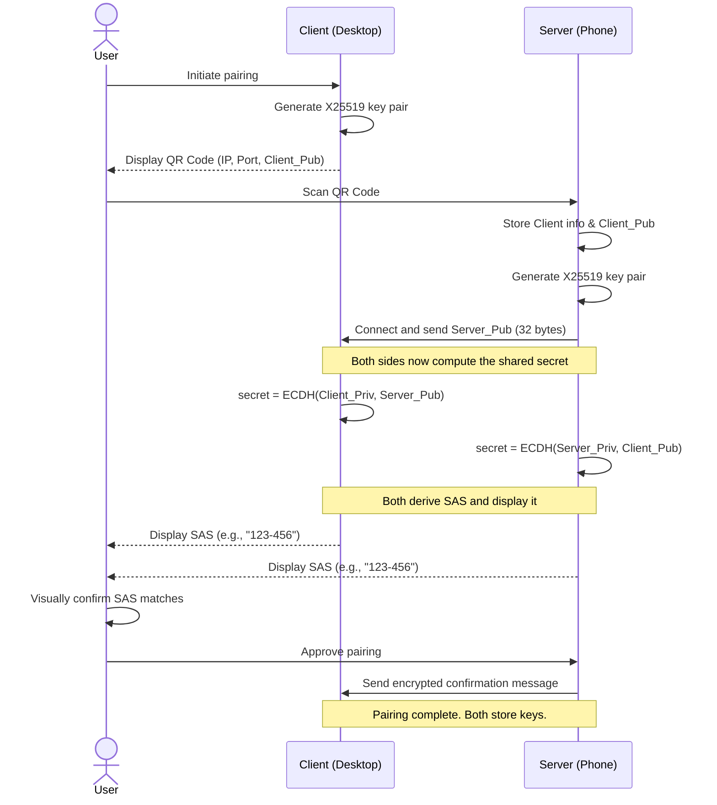

# Initial Key Exchange Protocol

## Overview

This document outlines a secure and byte-efficient protocol for the initial pairing of a **Client** (e.g., a Linux desktop) with a **Server** (e.g., an Android phone). The goal is to establish a mutually authenticated, secure channel for future communication, such as network-based PAM authentication. The protocol uses a QR code to bootstrap trust, the X25519 algorithm for a compact and fast key exchange, and a user-verified Short Authentication String (SAS) to prevent Man-in-the-Middle (MITM) attacks.

***

## Terminology

* **Client**: The software or device requesting authentication (e.g., the Linux desktop).
* **Server**: The software or device providing the authentication service (e.g., the Android phone).
* **User**: The person operating the devices.

***

## Cryptography and Keys

* **Key Exchange Algorithm**: **X25519**. This is chosen for its high security, excellent performance, and small 32-byte key size.
* **Client Key Pair** (`Client_Pub`, `Client_Priv`): An X25519 key pair for the desktop. The private key never leaves the Client.
* **Server Key Pair** (`Server_Pub`, `Server_Priv`): An X25519 key pair for the phone. The private key never leaves the Server.
* **Shared Symmetric Key** (`SK`): A key for a modern AEAD cipher like AES-256-GCM or ChaCha20-Poly1305. It is derived from the key exchange result using a KDF (e.g., HKDF-SHA256).

***

## Data Format and Efficiency

To minimize the number of bytes transmitted, all data is exchanged in a raw binary format.

* **QR Code Content**: A direct concatenation of binary data displayed by the Client (desktop).
    * `[Client IPv4 Address (4 bytes)] + [Port (2 bytes)] + [Client_Pub (32 bytes)]`
    * **Total Size**: 38 bytes. This is extremely compact and generates a simple, reliable QR code.
* **Server Handshake Message**: The Server's raw public key sent to the Client.
    * `[Server_Pub (32 bytes)]`
    * **Total Size**: 32 bytes.

***

## Pairing Protocol Visualization

***

## Pairing Protocol Steps

1.  **Client Presents QR Code**:
    * The **Client (desktop)** generates its long-term **Client Key Pair**.
    * It constructs a 38-byte binary payload containing its IP address, port, and public key, and encodes it into a QR code.

2.  **Server Initiates Connection**:
    * The **User** scans the QR code with the **Server (phone)**. The Server app decodes the binary data and immediately knows the Client's authentic public key and address.
    * The Server generates its long-term **Server Key Pair**.
    * The Server connects to the Client and sends its 32-byte `Server_Pub` as the only handshake message.

3.  **Key Agreement and Derivation**:
    * As soon as the Client receives the Server's public key, both parties have all the necessary information.
    * They independently compute the same `Shared_Secret` using the **X25519** function.
    * Both parties then use a Key Derivation Function (KDF) on the `Shared_Secret` to generate the final **Shared Symmetric Key** (`SK`) for encryption.

4.  **Anti-MITM Verification**:
    * Both the Client and Server compute a **Short Authentication String (SAS)** from the `Shared_Secret`.
    * Both devices display this SAS on their screens.

5.  **User Confirmation and Finalization**:
    * The **User visually confirms** that the SAS on both devices is identical and approves the pairing on the **Server (phone)**.
    * The Server sends a final, encrypted confirmation message to the Client using the newly derived `SK`.
    * Upon successful decryption of this message, the pairing is complete. Both Client and Server securely store the keys needed for future sessions.
