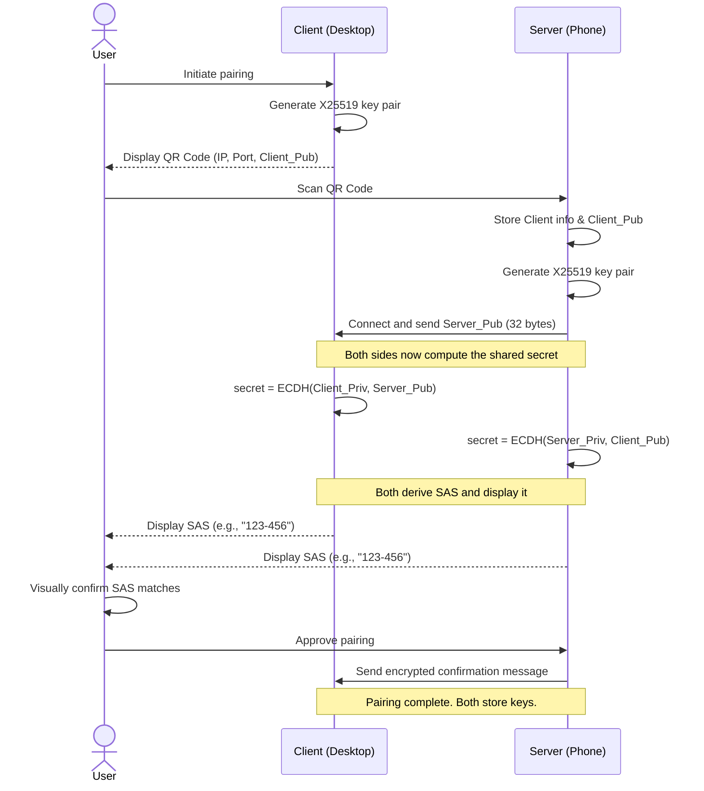

# Initial Key Exchange Protocol

## Overview

This document outlines a secure and byte-efficient protocol for the initial pairing of a **Client** (e.g., a Linux desktop) with a **Server** (e.g., an Android phone). The goal is to establish a mutually authenticated, secure channel for future communication, such as network-based PAM authentication. The protocol uses a QR code to bootstrap trust, the X25519 algorithm for a compact and fast key exchange, and a user-verified Short Authentication String (SAS) to prevent Man-in-the-Middle (MITM) attacks.

***

## Cryptography and Keys

* **Key Exchange Algorithm**: **X25519**. This is chosen for its high security, excellent performance, and small 32-byte key size.
* **Client Key Pair** (`Client_Pub`, `Client_Priv`): An X25519 key pair for the desktop. The private key never leaves the Client.
* **Server Key Pair** (`Server_Pub`, `Server_Priv`): An X25519 key pair for the phone. The private key never leaves the Server.
* **Shared Symmetric Key** (`SK`): A key for a modern AEAD cipher like AES-256-GCM or ChaCha20-Poly1305. It is derived from the key exchange result using a KDF (e.g., HKDF-SHA256).

***

## Pairing Protocol Visualization

***

## Pairing Protocol Steps

1.  **Client Presents QR Code**: The **Client (desktop)** generates its key pair and encodes its IP, port, and public key into a QR code.
2.  **Server Initiates Connection**: The **User** scans the code with the **Server (phone)**, which decodes the data, generates its own key pair, and connects to the Client, sending its public key.
3.  **Key Agreement and Derivation**: Both devices independently compute the same `Shared_Secret` using X25519 and derive a symmetric `SK`.
4.  **Anti-MITM Verification**: Both devices compute and display a **Short Authentication String (SAS)** from the secret.
5.  **User Confirmation and Finalization**: The **User visually confirms** the SAS matches and approves the pairing. The Server sends a final encrypted confirmation to the Client.