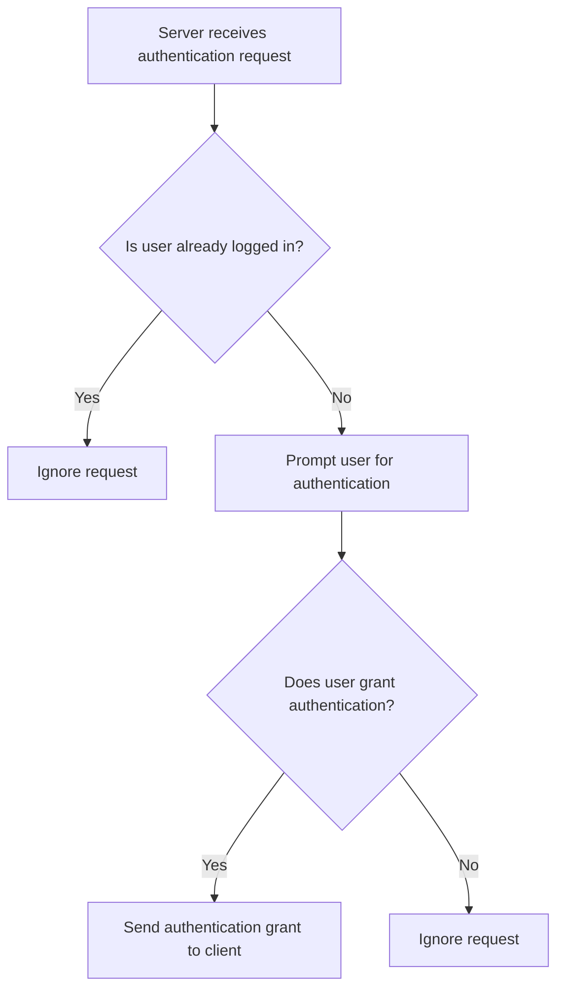

# User authentication interaction flow

## User grants authentication on server (i.e. scans their fingerprint)

When the server receives an authentication request from a client, it will prompt the user to authenticate. Currently, we only conceive of biometric authentication to be sufficiently secure and user-friendly for this purpose, and most other methods could be just as well handled by the client. The user will be asked to scan their fingerprint (or use another biometric method) to authenticate. As of this writing, normal android biometric authentication will be used, other schemes such as iOS FaceID will not be covered. The protocol itself is agnostic to the actual authentication method used. 



## User flow from receiving authentication request to being logged in on client

````mermaid
flowchart TD
    A[User starts their laptop, lands on login screen] --> B[User selects their account]
    B --> C[A notification is received on their phone]
    C --> D[User taps the notification]
    D --> E[The authentication app opens, showing the request]
    E --> F{Does user want to authenticate?}
    F -- No --> G[User dismisses the request, it times out after a while]
    F -- Yes --> H[User verifies their identity using biometric authentication]
    H --> I[The app shows a success message]
    I --> J[The laptop automatically logs in the user]
```