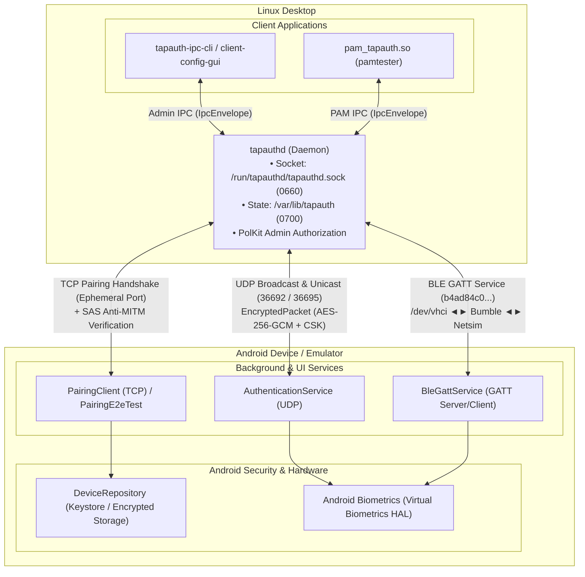

# TapAuth End-to-End (E2E) Testing Guide

This document describes the automated end-to-end (E2E) test harness for TapAuth, which tests the complete system lifecycle against a real Android device/emulator without mocks.

---

## 1. Overview & Test Architecture

The E2E test stack validates real cryptographic protocols, daemon state transitions, IPC boundaries, PAM module integration, network transports (TCP/UDP), and Bluetooth Low Energy (BLE) GATT communication against real Android software stacks and the Linux PAM infrastructure.



---

## 2. Test Lifecycle Phases

The master test runner (`scripts/test-e2e.sh`) executes a comprehensive test matrix covering positive authentication, protocol races, adversarial injections, timeout handling, and un-pairing:

### Phase 1: Real TCP Device Pairing & SAS Anti-MITM Verification
- **Phase 1a (Negative Pairing / SAS Rejection)**:
  1. Desktop starts an ephemeral TCP pairing listener.
  2. Android connects via `PairingE2eTest -e reject_sas true`.
  3. Ephemeral ECDH exchange completes and derives the SAS, but Android rejects the SAS confirmation and closes the TCP connection.
  4. Desktop's `complete-pairing` fails: the suite asserts both its non-zero exit code and that `get-servers` records 0 paired devices on disk.
- **Phase 1b (Legitimate Pairing Handshake)**:
  1. `tapauthd` generates a dynamic TCP listener port and ephemeral X25519 pairing keypair.
  2. Android emulator runs `PairingE2eTest` connecting to host `10.0.2.2:<port>`.
  3. Handshake executes:
     - `PairingHello` with Android public keys.
     - `PairingResponse` with Desktop public keys.
     - Both derive ephemeral PSK via ECDH and compute 6-digit Short Authentication String (SAS).
  4. Desktop and Android assert identical SAS codes (`XXX-XXX`).
  5. Desktop transmits AES-256-GCM encrypted Client Symmetric Key (CSK) with SHA-256 hash confirmation.
  6. Android stores paired desktop in `DeviceRepository`, and desktop saves server key to `/var/lib/tapauth/paired_servers.json`.
  7. State directory security properties are asserted (`/var/lib/tapauth` 700 `tapauthd:tapauthd`, key files 600, socket 660 `root:tapauthd-clients`).

### Phase 2: Local Network (UDP) End-to-End Authentication
1. Desktop enables UDP transport and disables BLE via admin IPC (`set-transports --network true --ble false`).
2. Authentication is requested for the test user via `tapauth-ipc-cli pam-auth <user> 20`.
3. `tapauthd` broadcasts `EncryptedPacket` on UDP port 36692 (and forwards to emulator port `36695` via dev shim).
4. `AuthenticationService` on Android receives packet, validates temporal ID via `TemporalIdCache`, decrypts `AuthRequest`, and prompts for biometrics.
5. Android verifies biometrics and replies with `AuthenticationGrant` signed by its Ed25519 key to `10.0.2.2:36692`.
6. `tapauthd` verifies signature, responds with `GrantConfirmation` (up to 3 times), and returns `SUCCESS` (0) to PAM client.

### Phase 2b: Real PAM Module Authentication (`pamtester`)
1. Test suite creates temporary PAM service definition at `/etc/pam.d/tapauth-test-e2e` pointing to `libclient_pam.so`.
2. `pamtester` invokes `pam_sm_authenticate` against the real Linux-PAM C ABI.
3. `client-pam` connects to `tapauthd` over Unix domain socket and completes full PAM authentication returning `PAM_SUCCESS`.

### Phase 2e: Mixed-Stack PAM Semantics (Grant Path)
1. A real-world PAM stack is installed: `auth [success=1 default=ignore] pam_tapauth.so` followed by `pam_unix.so` and `pam_permit.so`.
2. **Grant path**: with the device still paired, `pamtester` authenticates with stdin held open without data — `pam_sm_authenticate` returns `PAM_SUCCESS` upon phone grant and the `[success=1]` jump skips the password module entirely.

### Phase 2c: Adversarial UDP — Replay & `PamCancel`
1. The legitimate `AuthenticationGrant` from Phase 2 is captured via an `AF_PACKET` sniffer (`scripts/ci/udp_attack.py sniff`, root-only) and re-injected while a **fresh** auth session is pending.
2. The daemon rejects the stale-session grant (asserted: "Grant challenge verification failed" in audit log) and detects immediate duplicate injections via its per-session nonce cache (asserted: "Replayed packet detected").
3. The pending session is cancelled via `pam-cancel` IPC; the blocked client exits promptly with `OUTCOME=IGNORE` (never `SUCCESS`).

### Phase 2d: Adversarial UDP — Tampered Ciphertext
1. The captured grant is re-injected with a flipped bit inside the AES-256-GCM tag (protobuf framing and temporal ID stay intact).
2. The daemon fails AEAD verification, aborts fail-closed (`OUTCOME=IGNORE` → PAM password fallback), and logs "Failed to decrypt response packet".

### Phase 3: Bluetooth Low Energy (BLE) Authentication
1. Desktop enables BLE transport and disables UDP (`set-transports --network false --ble true`).
2. Authentication is requested over virtual BLE via Google Bumble + Netsim.
3. `tapauthd` acts as GATT Server and Peripheral advertiser (`b4ad84c0-2adb-4876-8315-b39d983b2bde`).
4. Android `BleGattService` acts as GATT Client and Central scanner, exchanging `AuthRequest` and `AuthenticationGrant` characteristics.

### Phase 4: Parallel Discovery Race (UDP + BLE Simultaneous)
1. Both transports enabled (`set-transports --network true --ble true`).
2. Desktop fires simultaneous discovery on UDP and BLE.
3. First responding transport wins; `tapauthd` cleans up the competing transport without duplicate grant conflicts.

### Phase 5: Explicit User Denial
1. Authentication requested while auto-grant helper is paused.
2. Simulated biometric rejection / `ACTION_DEV_DENY` broadcast is triggered.
3. Android sends signed `AuthenticationDenial`.
4. `tapauthd` returns `DENIED` outcome to PAM module.

### Phase 5b: Authentication Timeout Verification
1. Android app is stopped so no device responds to the auth broadcast.
2. Authentication is requested with a 2-second timeout.
3. `tapauthd` detects deadline expiry, broadcasts `AuthenticationCancel`, and returns `TIMEOUT` outcome.

### Phase 6: Device Removal / Un-pairing Lifecycle
1. Desktop invokes `remove-device <server_public_key>` via admin IPC.
2. `tapauthd` removes server, purges keys, and refreshes in-memory state.
3. Subsequent auth requests immediately return `IGNORE` ("No paired devices configured").

### Phase 6b: Mixed-Stack PAM Password Fallback
1. With no paired devices, `pamtester` is invoked against the mixed stack.
2. `pam_tapauth.so` returns `PAM_IGNORE`, allowing fallthrough to `pam_unix.so`.
3. Asserts that a correct password succeeds and an incorrect password fails.

### Phase 7: Admin IPC Authorization Enforcement (PolKit)
1. An unprivileged user **in** `tapauthd-clients` group sends an admin request — daemon denies it via PolKit (`auth_admin`) and records an audit log.
2. An unprivileged user **outside** `tapauthd-clients` cannot connect to `/run/tapauthd/tapauthd.sock` (0660 permission gate).

---

## 3. Defense-in-Depth & Protocol Unit Test Coverage

In addition to end-to-end integration flows, core protocol defenses are verified through dedicated unit test suites:

- **`RequestRateLimiterTest`**:
  - Burst allowance (first 3 distinct requests in 2s accepted without penalty).
  - Escalating backoff doubling upon rejection ($1\text{s} \to 2\text{s} \to 4\text{s} \to \max 5\text{s}$).
  - Re-transmission de-duplication pass-through without backoff escalation.
  - Per-client state reset on session completion (`resetClient`).
- **`ReplayMitigationCacheTest`**:
  - Primary defense: Challenge nonce replay cache rejection.
  - Secondary defense: Rejection of timestamps outside the $\pm 60$-second window.
  - Acceptance of valid timestamps and cache clearing.
- **`RetransmissionManagerTest`**:
  - 500ms fixed interval retransmission for `AuthenticationGrant` and `AuthenticationDenial`.
  - Immediate cancellation when `GrantConfirmation` is received.

`TemporalIdCache` (O(1) pre-authentication filter across current and previous 60s windows, with
immediate cache clearance when the paired-device list becomes empty) has no dedicated JVM unit
test; its behavior is exercised end-to-end by Phases 2–4, where every inbound packet must pass
its filter before decryption.

---

## 4. Transport Virtualization Details

### UDP Network Bridge
Android emulators run on a virtual NAT subnet (`10.0.2.15`), where `10.0.2.2` represents the host.
- **Inbound (Host $\to$ Emulator)**: In dev mode (`TAPAUTH_DEV_MODE`, feature `dev-udp-loopback`), the daemon unicasts every request to `127.0.0.1:36695` (configured via `TAPAUTH_DEV_UDP_TARGET`), which `adb emu redir add udp:36695:36692` forwards directly to the guest emulator. The same feature makes the receiver accept locally-sourced replies, which the production filter would otherwise drop as self-sent.
- **Outbound (Emulator $\to$ Host)**: Android replies directly to `senderAddress.hostAddress:appConfig.udpPort` (`10.0.2.2:36692`), which SLIRP delivers to the daemon's socket.

### Virtual BLE Bridge (Google Bumble + Netsim)
Android emulators provide an internal Bluetooth simulation service called **Netsim** on gRPC port 8554.
- `bumble-hci-bridge` connects to `android-netsim:localhost:8554` and bridges HCI packets to Linux `/dev/vhci`.
- BlueZ on Linux discovers the virtual controller and exposes it as a standard Bluetooth adapter (e.g. `hci1`).
- `tapauthd` publishes its GATT service and BLE advertisements via BlueZ, and the Android emulator scans and connects.

### Biometric Virtualization (Android Virtual Biometrics HAL)
- `scripts/ci/emulator-bio-helper.sh setup` configures Android 14+ Virtual Biometrics HAL (`persist.vendor.fingerprint.virtual.enrollments 1` + `cmd fingerprint sync`).
- Background auto-grant daemon (`emulator-bio-helper.sh start-auto-grant`) monitors logcat for prompt display and issues `adb emu finger touch 1`.
- Safe fallback: in `e2e` build variant (`BuildConfig.E2E_TESTING == true`), un-enrolled environments auto-approve after a brief delay.

---

## 5. Running the Tests

### In CI (GitHub Actions)
E2E testing runs in `.github/workflows/ci-android.yml` on every pull request and push to `main`.

CI runs in **systemd mode**: the daemon is installed as the real `tapauthd.service`/`tapauthd.socket`
units, is socket-activated (no `fallback-socket`), runs as the unprivileged `tapauthd` user, and keeps
state in `/var/lib/tapauth` and config in `/etc/tapauth/config.toml`. The binary enables only two dev
features — `dev-udp-loopback` (the emulator UDP shim; a hosted runner has no LAN broadcast path into the
emulator) and `dev-polkit-bypass` (so the root harness needs no authentication agent). `dev-state-override`
is **off**, so `TAPAUTH_STATE_DIR` is not compiled in at all and every path is the production one. Phase 7
therefore proves that PolKit still denies unprivileged non-owner callers; it does not prove anything about
the root path, which is bypassed by design in this build.

Other CI steps that back this suite:
- `./gradlew test` runs the Android JVM unit tests (§3) without an emulator.
- `./scripts/ci/check-production-build.sh` verifies the shipped binaries contain no dev env-var overrides.

**CI Artifacts**:
- `tapauth-debug-apk`: Standard safe debug build.
- `tapauth-e2e-apk-UNSAFE-auto-approves`: Test-only auto-approving APK (short 7-day retention; never distribute or install on physical devices).

### Locally (Dev Sandbox vs. Systemd Mode)
The test runner automatically selects **dev mode** when run unprivileged:
- `TAPAUTH_STATE_DIR`: Isolated state directory (`/tmp/tapauth-e2e.XXXXXX/state`).
- `TAPAUTHD_SOCK`: Isolated Unix socket (`/tmp/tapauth-e2e.XXXXXX/tapauthd.sock`).
- `TAPAUTH_DEV_MODE=1`: Enables the dev sandbox (same-UID PolKit bypass on the isolated socket).

Running locally as root with `TAPAUTH_E2E_DAEMON_MODE=systemd` exercises full production wiring against
`/etc/tapauth` and `/var/lib/tapauth`. Because that mode installs over a real system installation
(`/usr/bin/tapauthd`, the systemd units, `/etc/tapauth`, `/var/lib/tapauth`), it **refuses to run** when it
finds an existing daemon binary or a non-empty state directory; set `TAPAUTH_E2E_ALLOW_DESTRUCTIVE=1` to
acknowledge that your own pairing state and binaries will be replaced. Whatever the suite installs it also
removes again on exit (units, drop-in, binaries, registered PolKit policy, created config), and it never
deletes files that already existed.

#### Prerequisites
1. Have an Android emulator running (API 33 to 36):
   ```bash
   emulator @<your_avd_name>
   ```
2. Build Android E2E APKs:
   ```bash
   cd server-android && ./gradlew assembleE2e assembleE2eAndroidTest
   ```
3. Run Test Suite:
   ```bash
   ./scripts/test-e2e.sh
   ```

> **Virtual BLE is mandatory.** `scripts/ci/setup-emulator-ble-bridge.sh` builds/loads `hci_vhci` when the
> kernel lacks it and exits non-zero if no virtual adapter appears; the suite then aborts rather than
> skipping Phases 3 and 4.

---

## 6. One-Time Setup for Local Virtual BLE (`/dev/vhci`)

To allow non-root access to `/dev/vhci` for virtual Bluetooth controller creation:

```bash
# Ensure kernel module is loaded
sudo modprobe hci_vhci

# Add udev rule for persistent non-root access
echo 'KERNEL=="vhci", MODE="0666"' | sudo tee /etc/udev/rules.d/99-vhci.rules
sudo udevadm control --reload-rules && sudo udevadm trigger

# Immediate permissions for current session:
sudo chmod 666 /dev/vhci
```
